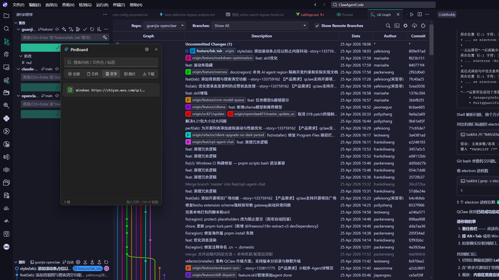

# PinBoard

> 一款常驻置顶的 Windows 桌面钉板小工具 ── 把你最常用的文件、文字、图片"钉"在屏幕一角，一键复制 / 打开 / 拖出，告别"我那个文件放哪了"。

<p align="center">
  
</p>

<p align="center">
  <a href="https://github.com/SongYafei/pinboard/releases/latest">
    
  </a>
  <a href="https://github.com/SongYafei/pinboard/releases">
    
  </a>
  
  
  
  
</p>

---

## ✨ 特性

- 🪟 **常驻置顶**：无边框 + Mica/Acrylic 半透明，永远在屏幕一角，随手可取
- 📂 **三类卡片**：文件引用、文字片段、图片，统一钉住统一管理
- 🚀 **一键复制**：点卡片即复制 ── 文件 → `CF_HDROP`、文字 → 文本、图片 → `CF_BITMAP`，能直接粘到微信 / 邮件 / 资源管理器
- 🖱️ **双击打开 + 拖出**：双击文件卡用默认程序打开；按住卡片可直接拖到其他软件发送
- 🔍 **搜索 + 标签 + Pin**：内容、文件名、标签三向过滤；常用项 Pin 置顶；按使用次数智能排序
- 📋 **剪贴板监听**：复制内容后弹 toast 一键钉住（可关）
- ⌨️ **全局快捷键**：`Ctrl + Shift + V` 任何场景一键呼出 / 隐藏
- 🎨 **明暗主题**：跟随系统自动切换
- 🪪 **失效检测**：源文件被删除 / 移动后自动置灰，可一键过滤
- 🔌 **系统托盘 + 开机自启**：可开关
- 💾 **SQLite 本地持久化**：重启自动恢复
- 🪶 **轻量**：安装包 < 4 MB（NSIS），无 Electron 之臃肿

## 📸 截图

<p align="center">
  
</p>

## 📦 下载安装

前往 [**Releases 页面**](https://github.com/SongYafei/pinboard/releases/latest) 下载：

| 安装包 | 推荐场景 |
|---|---|
| `PinBoard_x.x.x_x64-setup.exe`（NSIS） | **推荐**，体积更小，安装更快 |
| `PinBoard_x.x.x_x64_zh-CN.msi`（MSI） | 企业 / 静默部署场景 |

要求：**Windows 10 1809+ / Windows 11**，x64

> 首次启动若被 SmartScreen 拦截，点"更多信息" → "仍要运行"即可（应用未做代码签名）。

## 🚀 快速使用

1. 安装并启动后，窗口自动置顶在屏幕右上角
2. 把文件 / 图片 / 选中的文字直接 **拖** 进窗口 → 自动出现卡片
3. 想要时 **点** 卡片 → 内容已在剪贴板，去任何地方 `Ctrl+V` 粘贴即可
4. 文件卡 **双击** 用默认程序打开，**右键** 还有"在资源管理器中显示 / 复制路径 / 编辑标签 / 置顶 / 删除"等
5. 按 `Ctrl + Shift + V` 一键呼出 / 隐藏

## 🛠️ 技术栈

| 分层 | 技术 |
|---|---|
| 框架 | [Tauri 2.x](https://tauri.app/) |
| 前端 | React 18 + TypeScript + Vite |
| UI | 自研组件 + [Fluent UI 2](https://react.fluentui.dev/) + [lucide-react](https://lucide.dev/) |
| 状态 | [Zustand](https://zustand-demo.pmnd.rs/) |
| 数据 | SQLite (`tauri-plugin-sql`) |
| 样式 | CSS Variables + CSS Modules |
| 后端 | Rust（剪贴板 / 拖出 / 托盘 / 全局快捷键） |
| 打包 | Tauri bundler（MSI / NSIS） |

## 🧑‍💻 本地开发

### 环境要求

- [Node.js](https://nodejs.org/) 18+
- [Rust](https://www.rust-lang.org/tools/install) stable
- Windows：[Microsoft Visual Studio C++ Build Tools](https://visualstudio.microsoft.com/visual-cpp-build-tools/) + WebView2

### 启动

```bash
git clone https://github.com/SongYafei/pinboard.git
cd pinboard
npm install
npm run tauri dev      # 开发模式（热重载）
```

### 打包

```bash
npm run tauri build    # 输出 src-tauri/target/release/bundle/{msi,nsis}/
```

### 目录结构

```
pinboard/
├── src/                  # React 前端
│   ├── components/       # 标题栏、列表、卡片、设置、拖入区...
│   ├── store/            # Zustand 状态：list / settings / theme
│   ├── services/         # SQLite / 剪贴板 / 文件系统 / 拖拽
│   ├── hooks/            # 主题、剪贴板监听、文件存在性检测
│   └── styles/           # tokens.css + global.css
├── src-tauri/            # Rust 后端
│   └── src/
│       ├── commands/     # clipboard / fs / drag
│       ├── tray.rs       # 系统托盘
│       ├── window.rs     # 窗口管理（Mica / 置顶）
│       └── autostart.rs  # 开机自启
├── design/               # 图标源文件（SVG / PNG）
└── package.json
```

## 🗺️ Roadmap

- [ ] 卡片分组 / 多面板
- [ ] 云同步（可选，端到端加密）
- [ ] Markdown 渲染的文字卡
- [ ] 历史快照（误删找回）
- [ ] macOS / Linux 适配（Tauri 跨平台底子已有）

## 🤝 贡献

欢迎 Issue / PR！
- Bug 报告请附 Windows 版本 + 复现步骤
- 功能建议尽量带使用场景，避免"为加而加"

## 📄 License

[MIT](LICENSE) © SongYafei
